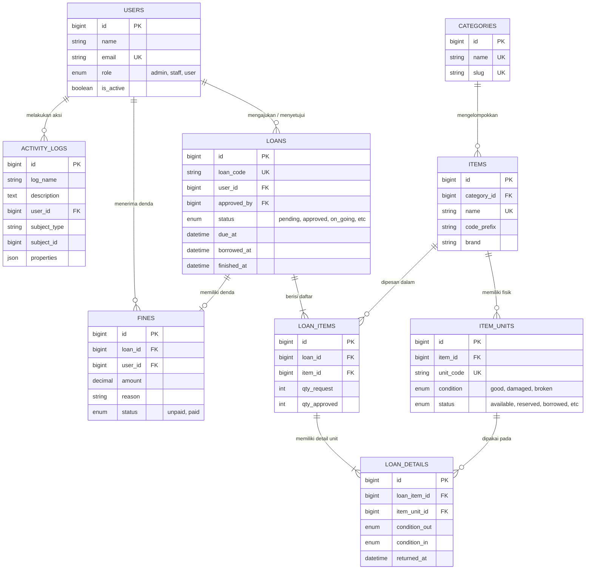

# Dokumentasi UKK - Sarprago (Sistem Peminjaman Sarpras)

Dokumen ini menyajikan metode pengembangan, struktur data, diagram, serta dokumentasi modul berdasarkan implementasi pada proyek **SarpraGo** menggunakan **Laravel 12** dan **Filament v5**.

---

## A) Deskripsi Program

### 1. Tujuan Sistem
* Mengotomatisasi prosedur peminjaman sarana dan prasarana agar lebih terstruktur.
* Menyediakan data stok unit barang yang akurat dan real-time.
* Meminimalisir risiko kehilangan atau kerusakan aset melalui sistem pelacakan unit.
* Mempercepat proses persetujuan dan serah terima barang antara petugas dan siswa.
* Menciptakan transparansi riwayat peminjaman dan pengelolaan denda.
* Menghasilkan audit trail yang lengkap melalui pencatatan log aktivitas sistem.

### 2. Aktor dan Hak Akses
* **Administrator:** 
    * Login dan Logout
    * CRUD Modul User
    * CRUD Modul Category
    * CRUD Modul Item dan ItemUnit
    * CRUD Modul Loan, LoanItem, dan LoanDetail
    * CRUD Modul Fine
    * View Modul ActivityLog
    * Mencetak laporan untuk Loan
    * Akses ke panel user
    * Akses ke panel admin

* **Staff/Operator:** 
    * Login dan Logout
    * Akses terbatas ke Modul Loan, LoanItem, dan LoanDetail
    * Akses terbatas ke Modul Fine
    * Mencetak laporan untuk Loan
    * Akses ke panel user
    * Akses terbatas ke panel admin
* **User/Siswa:** 
    * Login dan Logout
    * Akses ke panel user
    * Mengajukan Loan

### 3. Kebutuhan Fungsional (ringkas)
* Sistem harus dapat melakukan CRUD data Category, Item, ItemUnit, dll.
* Sistem harus menyediakan form pengajuan Loan dengan validasi stok otomatis.
* Sistem harus mendukung fitur approval (approve/reject) oleh pihak Admin dan Staff.
* Sistem harus memiliki fitur hand-over (serah terima) unit secara manual atau otomatis.
* Sistem harus memiliki fitur untuk membuat denda (manual)
* Sistem harus menyimpan log setiap perubahan data penting ke tabel ActivityLog.
* Sistem harus mampu mencetak laporan atau ringkasan transaksi peminjaman.
* Sistem harus memvalidasi status unit menjadi 'borrowed' saat sedang dipinjam.
* Dan lainnya.

### 4. Kebutuhan Non-Fungsional (ringkas)
* **Security:** Enkripsi password menggunakan algoritma Bcrypt bawaan Laravel.
* **Integrity:** Penggunaan Database Transaction untuk menjamin konsistensi data transaksi.
* **Performance:** Penggunaan cache dan eager-load untuk menghindari N+1.
* **Reliability:** Sistem harus tetap berjalan stabil meskipun menangani banyak data log.
* **Availability:** Aplikasi berbasis web sehingga dapat diakses kapan saja melalui browser.
* **Usability:** Antarmuka responsif menggunakan Filament PHP agar mudah diakses lewat HP.

---

## B) Schema dan ERD

### 1. Struktur Data (Database Schema)

#### Tabel: `users` (Model: `User`)
| Field | Tipe | Aturan/Pembatasan | Keterangan |
| --- | --- | --- | --- |
| `id` | BIGINT | PK, AI | ID Utama User |
| `name` | VARCHAR | NOT NULL | Nama Lengkap |
| `email` | VARCHAR | UNIQUE, NOT NULL | Alamat Email |
| `password` | VARCHAR | NOT NULL | Password (Hashed) |
| `role` | ENUM | `admin`, `staff`, `user` | Level Akses (Default: user) |
| `is_active` | BOOLEAN | Default: true | Status Akif Akun |
| `deleted_at` | TIMESTAMP | Nullable | Soft Delete |

#### Tabel: `categories` (Model: `Category`)
| Field | Tipe | Aturan/Pembatasan | Keterangan |
| --- | --- | --- | --- |
| `id` | BIGINT | PK, AI | ID Kategori |
| `name` | VARCHAR | UNIQUE, NOT NULL | Nama Kategori |
| `slug` | VARCHAR | UNIQUE, NOT NULL | URL Friendly Name |

#### Tabel: `items` (Model: `Item`)
| Field | Tipe | Aturan/Pembatasan | Keterangan |
| --- | --- | --- | --- |
| `id` | BIGINT | PK, AI | ID Barang |
| `category_id` | FK | `categories` (Restrict) | Relasi Kategori |
| `name` | VARCHAR | UNIQUE, NOT NULL | Nama Barang |
| `slug` | VARCHAR | UNIQUE, NOT NULL | URL Friendly Name |
| `brand` | VARCHAR | Nullable | Merk Barang |
| `code_prefix` | VARCHAR | NOT NULL | Awalan Kode Asset |
| `image_path` | VARCHAR | Nullable | Path Foto Barang |

#### Tabel: `item_units` (Model: `ItemUnit`)
| Field | Tipe | Aturan/Pembatasan | Keterangan |
| --- | --- | --- | --- |
| `id` | BIGINT | PK, AI | ID Unit Spesifik |
| `item_id` | FK | `items` (Cascade) | Induk Barang |
| `unit_code` | VARCHAR | UNIQUE, NOT NULL | Serial Number / Kode Unik |
| `condition` | ENUM | `good`, `damaged`, `broken` | Kondisi Fisik |
| `status` | ENUM | `available`, `reserved`, `borrowed`, etc. | Status Ketersediaan |
| `attributes` | JSON | Nullable | Spek tambahan (Warna, dll) |

#### Tabel: `loans` (Model: `Loan`)
| Field | Tipe | Aturan/Pembatasan | Keterangan |
| --- | --- | --- | --- |
| `id` | BIGINT | PK, AI | ID Transaksi |
| `loan_code` | VARCHAR | UNIQUE, NOT NULL | No. Referensi Pinjam |
| `user_id` | FK | `users` (Cascade) | ID Peminjam |
| `approved_by` | FK | `users` (Set Null) | ID Petugas Penyetuju |
| `status` | ENUM | `pending`, `approved`, `on_going`, etc. | Status Transaksi |
| `borrowed_at` | DATETIME | Nullable | Waktu Serah Terima |
| `due_at` | DATETIME | NOT NULL | Tenggat Pengembalian |
| `finished_at` | DATETIME | Nullable | Waktu Selesai |

#### Tabel: `loan_items` (Model: `LoanItem`)
| Field | Tipe | Aturan/Pembatasan | Keterangan |
| --- | --- | --- | --- |
| `id` | BIGINT | PK, AI | ID Baris Item |
| `loan_id` | FK | `loans` (Cascade) | Parent Transaksi |
| `item_id` | FK | `items` (Cascade) | Barang yang Dipilih |
| `qty_request` | INT | NOT NULL | Jumlah yang Diminta |
| `qty_approved` | INT | Default: 0 | Jumlah Disetujui Petugas |

#### Tabel: `loan_details` (Model: `LoanDetail`)
| Field | Tipe | Aturan/Pembatasan | Keterangan |
| --- | --- | --- | --- |
| `id` | BIGINT | PK, AI | ID Detail Unit |
| `loan_item_id` | FK | `loan_items` (Cascade) | Hubungan ke Item Pinjam |
| `item_unit_id` | FK | `item_units` (Cascade) | Unit Fisik yang Dipakai |
| `condition_out` | ENUM | `good`, `damaged` | Kondisi Awal |
| `condition_in` | ENUM | `good`, `damaged`, `broken` | Kondisi Akhir |
| `returned_at` | DATETIME | Nullable | Waktu Unit Kembali |

#### Tabel: `fines` (Model: `Fine`)
| Field | Tipe | Aturan/Pembatasan | Keterangan |
| --- | --- | --- | --- |
| `id` | BIGINT | PK, AI | ID Denda |
| `loan_id` | FK | `loans` (Cascade) | Transaksi Terkait |
| `user_id` | FK | `users` (Cascade) | Target Denda |
| `amount` | DECIMAL | 12,2 | Nominal Rupiah |
| `reason` | VARCHAR | NOT NULL | Alasan (Terlambat/Rusak) |
| `status` | ENUM | `unpaid`, `paid` | Status Pelunasan |

#### Tabel: `activity_logs` (Model: `ActivityLog`)
| Field | Tipe | Aturan/Pembatasan | Keterangan |
| --- | --- | --- | --- |
| `id` | BIGINT | PK, AI | ID Log |
| `description` | TEXT | NOT NULL | Detail Aktivitas |
| `user_id` | BIGINT | Nullable | ID Aktor |
| `subject_id/type`| MORPH | NOT NULL | Objek yang Berubah |
| `properties` | JSON | Nullable | Data Lama & Data Baru |

---

### 2. ERD (Entity Relationship Diagram)

---

## C) Dokumentasi Fungsi dan Proses (Simplified)

Bagian ini merangkum logika utama yang menjalankan fitur-fitur kritikal pada sistem **SarpraGo**.

### 1. Fungsi Otomatisasi (Helpers)
* **Auto-Numbering (Loan Code):** * **Logika:** Menggabungkan prefix `LOAN`, tahun berjalan, dan nomor urut dari database (Contoh: `LOAN-2026-001`).
    * **Tujuan:** Menjamin keunikan setiap nomor transaksi peminjaman.
* **Activity Formatter:** * **Logika:** Mendeteksi perubahan nilai pada model (`getChanges`), membuang kolom sensitif, dan mengubahnya menjadi format JSON.
    * **Tujuan:** Menyediakan data audit trail yang mudah dibaca pada tabel *Activity Logs*.

### 2. Proses Bisnis Utama (Workflows)
* **Proses Persetujuan (Approval):**
    1.  Admin memvalidasi ketersediaan fisik barang.
    2.  Admin menentukan jumlah unit yang disetujui (`qty_approved`).
    3.  Sistem mengubah status menjadi `approved` atau `partially_approved`.
* **Proses Serah Terima (Hand-Over):**
    1.  Sistem mencari unit fisik dengan status `available` (Mode Auto) atau Admin memilih unit secara spesifik (Mode Manual).
    2.  Sistem mengubah status unit menjadi `borrowed` secara *silent* (tanpa memicu log berlebih).
    3.  Mencatat kondisi awal barang (`condition_out`) saat keluar dari gudang.
* **Proses Pengembalian & Denda (Finish Loan):**
    1.  Petugas mengecek kesesuaian unit yang kembali dan kondisi akhirnya (`condition_in`).
    2.  Sistem menghitung keterlambatan berdasarkan `due_at`.
    3.  Jika ada keterlambatan atau kerusakan, sistem membuat record `fines` (Denda) secara otomatis/manual.
    4.  Status unit dikembalikan menjadi `available`.
* **Proses Pelunasan Denda:**
    1.  Admin memverifikasi pembayaran dari user.
    2.  Sistem mengubah status denda menjadi `paid` dan mencatat waktu pelunasan.

### 3. Keamanan & Hak Akses (Middleware/Policy)
* **RBAC (Role Based Access Control):** * **Logika:** Mengecek kolom `role` pada tabel `users`.
    * **Tujuan:** Membatasi akses menu (Admin bisa CRUD semua, User hanya bisa melihat katalog dan meminjam).

---

## D) Pengujian dan Screenshot Hasil Uji

### 1. Login
